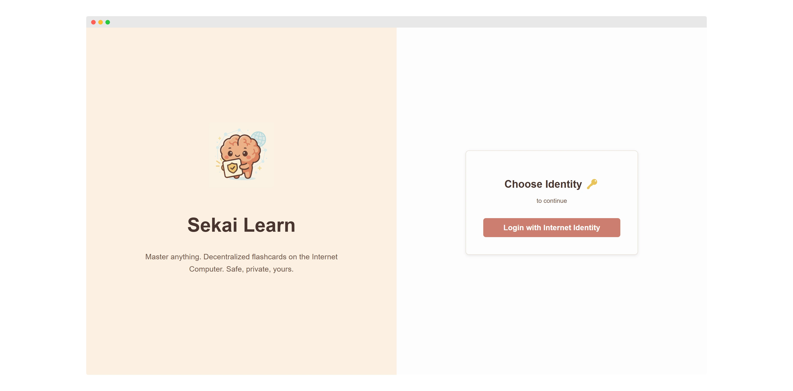

# ICP Flashcard App (Sekai Learn)

[](https://opensource.org/licenses/MIT) <!-- Optional: Add a license badge -->

**Sekai Learn** is a decentralized flashcard application built on the Internet Computer (ICP), inspired by spaced repetition systems like Anki. It empowers users to create topics, manage flashcards, practice efficiently, track progress, and set review reminders, all while maintaining full ownership and control over their data.

The application leverages Internet Identity for secure authentication. Each user's topics, flashcards, and score history are stored directly on the ICP blockchain within the application's canister, associated exclusively with their unique Principal ID. This ensures data privacy and sovereignty.





## Core Features

*   **Secure Authentication:** Login via Internet Identity. Data is encrypted and tied to the user's Principal.
*   **Topic Organization:** Create, view, and delete distinct topics (e.g., "Japanese Vocabulary," "ICP Concepts") to categorize flashcards.
*   **Flashcard Management:** Easily add, view, edit, and delete flashcards with distinct 'Front' and 'Back' content within selected topics.
*   **Practice Mode:** Engage in review sessions for chosen topics. Cards are presented, and users mark them as 'Correct' or 'Incorrect'.
*   **Score History:** Review past practice session results (correct/incorrect counts and timestamps) for each topic.
*   **Spaced Repetition (Simplified):** Based on practice performance, the app calculates a suggested next review date for the topic.
*   **Review Reminders:** Manually set a specific future date for the next review session. Topics due for review are visually highlighted with a '🔔' icon.

## How It Works (Storage & Persistence)

*   **User Data:** All user-generated content (topics, cards, scores) is stored within the backend canister's memory during runtime.
*   **Data Structure:** Motoko's `RBTree` (Red-Black Tree) is used for efficient in-memory lookup, insertion, and deletion of data, keyed by IDs or user Principals.
*   **Persistence:** To ensure data survives canister upgrades, the application utilizes ICP's **stable memory**.
    *   **`preupgrade` Hook:** Before an upgrade, all data from the `RBTree` structures is serialized into simple arrays (e.g., `[(TopicId, TopicData)]`) and written to stable variables.
    *   **`postupgrade` Hook:** After the upgrade completes, the code reads the serialized data back from the stable variables and repopulates the `RBTree` structures in the new canister instance's memory.
    *   *(Rationale: This manual serialization approach using arrays/tuples in stable variables was implemented due to potential complexities or limitations encountered with directly using `StableBTreeMap` or similar stable structures within the specific development context or environment constraints at the time of building.)*

## Technology Stack

*   **Backend:**
    *   Language: **Motoko**
    *   Runtime: Internet Computer Canister (Smart Contract)
    *   Data Structures: `RBTree` (in-memory), `Array` / `Tuple` (for stable variable serialization)
*   **Frontend:**
    *   Framework: **React**
    *   Build Tool: **Vite**
    *   Styling: Inline Styles (JavaScript objects)
    *   Core UI: Standard HTML elements (no external component libraries like Shadcn UI, Material UI, etc.)
*   **ICP Integration:**
    *   Authentication: **Internet Identity** via `@dfinity/auth-client`
    *   Canister Communication: `@dfinity/agent`
*   **Development & Deployment:**
    *   **DFINITY SDK (`dfx`)**

## Getting Started (Local Development)

1.  **Prerequisites:**
    *   [Node.js](https://nodejs.org/) (LTS version recommended)
    *   [DFINITY SDK (`dfx`)](https://internetcomputer.org/docs/current/developer-docs/getting-started/install/)
2.  **Clone Repository:**
    ```bash
    git clone <your-repo-url>
    cd <your-repo-directory>
    ```
3.  **Start Local Replica:** In a separate terminal window, run:
    ```bash
    dfx start --background --clean
    ```
    *(Ensures a fresh local ICP environment)*
4.  **Install Dependencies:** Install both root Node.js dependencies and frontend dependencies:
    ```bash
    npm install
    ```
5.  **Deploy Canisters:** Deploy the backend canister to your local replica:
    ```bash
    dfx deploy
    ```
    *(This command also generates necessary type declarations for the frontend)*
6.  **Run Frontend Dev Server:**
    ```bash
    npm run dev
    ```
7.  **Access Application:** Open the URL provided by Vite in your browser (usually `http://localhost:5173` or similar – check the terminal output). You will interact with your locally deployed canister.